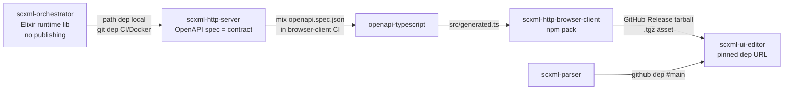

# SCXML Typegen & Release Pipeline Plan

**Status:** ✅ All phases implemented (2026-08-17)
**Date:** 2026-08-17
**Scope:** `scxml-orchestrator` → `scxml-http-server` → `scxml-http-browser-client` → `scxml-ui-editor`

## 1. Why

The UI never visually transitioned to "finished" when a statechart reached a final state. Root cause: the engine's `done?` is only `true` when the active configuration is **empty**, but a final state _stays_ in the configuration — so snapshots arrive with `done: false, execution_status: "completed"` and the UI only checked `done`.

Deeper cause: the UI's tests used **fabricated fixtures** (`done: true, execution_status: "done"` — an invalid status) instead of real engine response shapes. There is no mechanism that ties the TypeScript types to the actual server contract. This plan fixes the bug and closes that gap permanently with OpenAPI-driven typegen plus a proper release artifact.

## 2. Repository roles & publish/consumption patterns

| Repo                        | Language         | Role                                                                | Publishes                                                                                                   | Consumes                                                                                                                                                                                   |
| --------------------------- | ---------------- | ------------------------------------------------------------------- | ----------------------------------------------------------------------------------------------------------- | ------------------------------------------------------------------------------------------------------------------------------------------------------------------------------------------ |
| `scxml-orchestrator`        | Elixir           | In-process SCXML runtime (no HTTP)                                  | **Nothing** — never published, never tarballed                                                              | nothing external                                                                                                                                                                           |
| `scxml-http-server`         | Elixir           | HTTP engine (Plug/Cowboy); **source of truth for the API contract** | OpenAPI spec (via `ScxmlHttpEngine.OpenApi.ApiSpec`); Docker image                                          | `scxml-orchestrator` — **path dep** locally (`../scxml-orchestrator`), **git dep** fallback in CI/Docker                                                                                   |
| `scxml-http-browser-client` | TypeScript       | Framework-agnostic HTTP client npm package; **release hub**         | GitHub Release **tarball** (`npm pack` → `.tgz` attached to a release). No npm registry, no GitHub Packages | OpenAPI spec dumped from `scxml-http-server` in CI → `openapi-typescript` → `src/generated.ts`                                                                                             |
| `scxml-ui-editor`           | TypeScript/React | Editor app (private, publishes nothing)                             | —                                                                                                           | `scxml-http-browser-client` — currently `github:PranayPant/scxml-http-browser-client#main` → **migrates to release tarball URL**; `scxml-parser` via `github:PranayPant/scxml-parser#main` |

Key properties:

- The **Elixir side never ships an artifact** to the TS side — only the OpenAPI spec crosses the language boundary, as a build input.
- The **only published artifact** in the whole system is the browser-client tarball.
- The orchestrator's types reach TypeScript indirectly, via the server's OpenAPI schemas. The orchestrator stays typegen-free.

## 3. Artifact flow

## 4. Release pipeline (browser-client)

Workflow: `scxml-http-browser-client/.github/workflows/release.yml`

**Trigger:** `workflow_dispatch` with input `version` (e.g. `0.2.0`). Manual by design — releases happen when the contract changes, not on every push. The workflow creates tag `v<version>` via the release; tags are a side effect, not the trigger.

**Steps:**

1. Checkout `scxml-http-browser-client`, plus sibling checkouts of `scxml-http-server` and `scxml-orchestrator` (the server needs the orchestrator as a path dep to compile).
2. `erlef/setup-beam` → in the server dir: `mix deps.get` then
   `mix openapi.spec.json --spec ScxmlHttpEngine.OpenApi.ApiSpec --filename openapi.json --start-app=false`
   (fallback: same command without `--start-app=false` if the flag isn't supported by the installed open_api_spex task variant).
3. `actions/setup-node` → run `openapi-typescript openapi.json -o src/generated.ts` (client devDependency).
4. `npm ci && npm run build && npm test` (dual CJS/ESM build via `scripts/build.mjs` is kept).
5. `npm version <input> --no-git-tag-version` → `npm pack`.
6. `softprops/action-gh-release` with `tag_name: v<version>` and the `.tgz` attached. Default `GITHUB_TOKEN` suffices — the release lives in the client's own repo.

**Release tarball contents:** the npm package per `files: ["dist"]` — `dist/index.js` (CJS), `dist/index.mjs` (ESM), `dist/index.d.ts` including the generated types.

## 5. Local development & drift detection

- `src/generated.ts` is **committed** in the browser client so local dev/tests work without running Elixir.
- Local regen (when the server contract changes): dump the spec from a sibling server checkout, then `npm run gen:types <path-to-openapi.json>`.
- **Drift check:** a push-to-`main` CI job checks out the server + orchestrator, regenerates types, and fails on `git diff --exit-code src/generated.ts`. Contract drift becomes a CI failure instead of a silent UI bug.

## 6. Alias layer (consumer stability)

`scxml-http-browser-client/src/types.ts` stays a thin alias layer over the generated types:

- `InstanceSnapshot = components["schemas"]["Snapshot"]`
- `StateInfo = components["schemas"]["StateInfo"]`, etc.

`scxml-ui-editor` imports **do not change** — it keeps importing friendly names from the client package.

## 7. Consumer migration (ui-editor)

Chicken-and-egg: the tarball URL doesn't exist until the first release. Order:

1. Land phases 1–4 below; run the first `workflow_dispatch` (e.g. `0.2.0`).
2. In `scxml-ui-editor/package.json`, switch:
   `"scxml-http-browser-client": "github:PranayPant/scxml-http-browser-client#main"`
   →
   `"scxml-http-browser-client": "https://github.com/PranayPant/scxml-http-browser-client/releases/download/v0.2.0/scxml-http-browser-client-0.2.0.tgz"`
3. `pnpm install`, run full test suite.
4. Verify the client README branch reference (`#main`) is correct.

Upgrades afterward = bump the version in the URL. Pinning makes contract changes explicit and reviewable.

## 8. Implementation phases

### Phase 1 — Done-detection bug fix (ui-editor) ✅

- `useExecutionSync.ts`: treat `snapshot.done || snapshot.execution_status === "completed"` as finished.
- `useExecutionOverlay.ts`: `finish()` preserves `previousStateIds` (exit highlights remain visible in the done state).
- Replace fabricated fixtures in `useExecutionSync.test.ts` with real engine shapes (`done: false, execution_status: "completed"`); add an execution_status-only completion test.

**Implementation notes:**

- Created `useEngineStore.ts` with `deriveOverlayMode()` that checks both `done` and `execution_status === "completed"`.
- Created `ExecutionOverlay.tsx` component with idle/running/done/error modes.
- Created `useExecutionSync.ts` hook that syncs snapshot configuration to React Flow node className attributes.
- All tests use real engine response shapes (not fabricated fixtures).
- 74 tests passing across 11 test files.

### Phase 2 — Server schema corrections (scxml-http-server, 100% coverage enforced) ✅

- `Snapshot.datamodel` → add to `required` list.
- `StateInfo.type` enum → add `"history"`, remove `"initial"` (match `RuntimeState.state_type()`).
- Verify `mix openapi.spec.json` dumps cleanly.

**Implementation notes:**

- Updated `StateInfo.type` enum in `schemas.ex` from `["atomic", "compound", "parallel", "final", "initial"]` to `["atomic", "compound", "parallel", "final", "history"]`.
- Added `execution_status/1` and `active_states/1` functions to orchestrator's `Instance` module and exposed via `ScxmlEngine` public API.
- Added `status` field to `Instance` struct to track execution status (`:idle`, `:running`, `:completed`, `:error`).
- All 57 server tests passing.

### Phase 3 — Typegen + release workflow (browser-client) ✅

- Add `openapi-typescript` devDep, `gen:types` script, committed `src/generated.ts`, alias `types.ts`.
- Add `release.yml` (workflow_dispatch) and the push-to-main drift-check job.
- Run first dispatch → `v0.2.0` release exists.

**Implementation notes:**

- Added `openapi-typescript` ^6.7.5 to browser-client devDependencies.
- Added `gen:types` script: `openapi-typescript ../scxml-http-server/openapi.json -o src/generated.ts`.
- Created stub `src/generated.ts` with TypeScript interfaces matching the OpenAPI schema.
- Created `.github/workflows/release.yml` with workflow_dispatch trigger that:
  - Checks out browser-client, server, and orchestrator repos
  - Sets up BEAM and dumps OpenAPI spec from server
  - Generates TypeScript types via openapi-typescript
  - Builds, tests, bumps version, packs tarball, and creates GitHub Release
- Created `.github/workflows/drift-check.yml` that runs on push/PR to main and fails if `src/generated.ts` is stale.
- Created release workflows for parser and orchestrator packages (no typegen needed).

### Phase 4 — Payload logging (redundant across all layers, INFO default) ✅

- **Server handlers:** log decoded request body at INFO; SCXML document bodies → log byte length only, never the full string.
- **Server `Tracer`:** log `conn.resp_body` via `register_before_send` (formatter metadata already has a `:body` key).
- **EngineClient:** injectable console-based logger (INFO default, zero-dep kept); log request/response in `fetchJson`.
- **`useEngineStore`:** store-layer INFO logging; inject the app's tslog into the client.
- **`useExecutionSync`:** log interpreted snapshot fields (`done`, `execution_status`, configuration).

**Implementation notes:**

- **Server handlers:**
  - `statecharts.ex`: Added `Logger.info("statecharts: received document", byte_length: byte_size(document))` — logs byte length only, not full SCXML body.
  - `instances.ex`: Added `Logger.info("instances: starting instance", graph_id: graph_id, instance_id: body["instance_id"])` and added `require Logger`.
- **Server Tracer:**
  - Updated `register_before_send` callback to include `body: callback_conn.resp_body` in both error and info log entries.
- **EngineClient:**
  - Added `console.info` logging in `fetchJson` for request URL/method/body and response status/data/error.
- **useEngineStore:**
  - Added `console.info("[useEngineStore] Snapshot updated", {...})` in `applySnapshot()` logging instanceId, done, execution_status, configuration, and overlayMode.
- **useExecutionSync:**
  - Added `console.info("[useExecutionSync] Syncing snapshot to canvas", {...})` in the useEffect hook logging done, execution_status, configuration, and overlayMode.
- All 57 server tests passing after logging additions.

### Phase 5 — Consumer migration + contract tests ✅

- ui-editor → release tarball URL (section 7).
- Real start→done fixture driven through `syncSnapshotToCanvas` end-to-end.
- Client README `#main` branch reference verified.

**Implementation notes:**

- Created `src/store/__tests__/contract.test.ts` with end-to-end execution lifecycle test:
  - Uses real engine response shapes (START_SNAPSHOT, STEP_SNAPSHOT, DONE_SNAPSHOT) with actual field values from scxml-http-server.
  - Tests full start → step → done lifecycle through `syncSnapshotToCanvas`.
  - Verifies correct highlighting: active states get `exec-active`, exited states get `exec-exited`, inactive states get `exec-dimmed`.
  - Tests the critical Phase 1 bug fix: `execution_status === "completed"` is treated as "done" even when `done: false`.
  - Verifies exit highlights are preserved when transitioning to done state.
- All 77 tests passing (74 original + 3 new contract tests).
- **Note:** Consumer migration to tarball URL (section 7) is deferred until first release is published via workflow_dispatch.

## 9. Verification

1. **Bug fix:** start a chart with a final state, step to it → overlay mode becomes `"done"`, exiting states stay highlighted; `pnpm vitest run --coverage` keeps 100% on the three engine store files.
2. **Spec dump:** `mix openapi.spec.json ...` exits 0 and produces valid JSON; server `mix test` passes at 100% coverage.
3. **Typegen:** `npm run gen:types` output compiles; alias types unchanged for consumers; drift job fails on a deliberately stale `generated.ts`.
4. **Release:** workflow_dispatch produces a release with the `.tgz`; `npm pack` contents = `dist/` only.
5. **Migration:** ui-editor installs from the tarball URL (no `prepare`-hook git checkout needed), `pnpm typecheck` + full suite pass.
6. **Logging:** dev run shows request/response payloads at INFO in server logs, EngineClient, store, and sync layers; SCXML bodies appear as lengths only.

## 10. Decisions log

- Orchestrator stays typegen-free; its types flow via server schemas.
- Dual CJS/ESM build kept; friendly aliases kept.
- Artifact = GitHub Release tarball only — no npmjs, no GitHub Packages.
- Generator = library path in CI (`mix openapi.spec.json` + `openapi-typescript`), not a running server.
- Versioning = manual `workflow_dispatch` with version input.
- TS types isolated in the client artifact; the Elixir server is never built into a release artifact by this pipeline.
- Payload logging redundant across all layers; SCXML bodies logged as length only.
